MA415 Lab: Deliverable 1
================
Superficial Intelligence (Nick, Jerry, Katherine, Cynthia)

Abstract
--------

In this project, we explore graduate admissions data from Grad Cafe. We are interested in understanding how the different variables affect admissions decisions, and how admissions differ across different schools and degree programs. We do not find too much many surprising results in this exploratory data analysis, with the exception of the most selective Universities and Majors. While this dataset is likely the most robust dataset we can find regarding graduate admissions, the data is self-reported and will likely contain some bias. It is hard to predict which covariates are the best predictors of admission decisions, but we hypothesize that this would depend on the program and the performance of the student measured by test scores and GPA.

Dataset Description
-------------------

For this project, we will use data on graduate admissions from Grad Cafe provided by Debarghya Das on GitHub. The data is self-reported by prospective graduate students on <https://www.thegradcafe.com/>. The dataset contains 345,303 observations and 19 variables with a mix of continuous and categorical data. The dataset contains the following variables:

1.  **rowid (integer)** - An integer id of the row

2.  **uni\_name (character)** - The name of the university

3.  **major(character)** - The name of the intended major

4.  **degree (character)** - The type of degree program

5.  **season (character)** - The season of application

6.  **decision (character)** - The admission decision

7.  **decision\_method (character) ** - The method through which decision was communicated

8.  **decision\_date (character)** - The date that the decision was communicated

9.  **decision\_timestamp (integer)** - timestamp of the decision

10. **ugrad\_gpa (double)** - undergraduate GPA

11. **gre\_verbal (double)** - GRE verbal score

12. **gre\_quant (double)** - GRE quantitative score

13. **gre\_writing (double)** - GRE writing score

14. **is\_new\_gre (logical)** - whether or not the applicant took the new GRE

15. **gre\_subject (double)** - GRE subject test score

16. **status (character)** - Status of the candidate. Can be "International", "International with US Degree", "American" or "Other"

17. **post\_data (character)** - The date in which the observation was posted on grad cafe

18. **post\_timestamp (integer)** - timestamp of the post

19. **comments (character)** - Applicants’ comments

We decided to drop variables which either contain little information such as 'gre\_subject', which few candidates reported, and 'rowid' which is redundant, and variables which are not of interest to us, such as 'comments', 'decision\_method', 'post\_data', and 'post\_timestamp'.

Some problems that we may expect to encounter in the data are missing values, biased data due to self-reporting (it may be possible that positive results are more likely to be reported), and possibly fake data. In addition to this, the data will likely require some cleaning as user fill out forms and may be inconsistent (for example school name might be "Boston University"" or "BU"). Lastly, 'ugrad\_gpa' could be based on different scales, such as a 10 point scale that is sometimes used internationally.

Research Questions
------------------

Our main question of interest is "How do the different variables relate to admission decision?" We are interesting in understanding how the different factors such as GPA, GRE scores, the degree program you are applying to, or status affect whether you are ultimately chosen for admission. We also aim to answer several "sub-questions" such as:

-   How do admissions statistics differ across schools?

-   How do admissions differ between Boston University and "top tier" schools?

-   How have admissions statistics changed over time? (2015, 2016, 2017)?

-   Is there a relationship between acceptance rate and season? (Is it easier to get enrolled in Spring semester or Fall semester?)

-   Relationship between acceptance rate and student status (American vs International students; International students with a US degree vs those without)

-   Does applying earlier make a difference in getting into a school?

We would like to explore these questions to help all of us who are interested in graduate school to better understand the admission process.

Data Import & Cleaning
----------------------

We start by importanting the neccesary packages and the dataset.

``` r
library(tidyverse)
```

    ## ── Attaching packages ───────────────────────────────────────── tidyverse 1.2.1 ──

    ## ✔ ggplot2 3.1.0     ✔ purrr   0.2.5
    ## ✔ tibble  1.4.2     ✔ dplyr   0.7.8
    ## ✔ tidyr   0.8.2     ✔ stringr 1.3.1
    ## ✔ readr   1.3.1     ✔ forcats 0.3.0

    ## ── Conflicts ──────────────────────────────────────────── tidyverse_conflicts() ──
    ## ✖ dplyr::filter() masks stats::filter()
    ## ✖ dplyr::lag()    masks stats::lag()

``` r
#library(plotly)
(grad <- read_csv("data/grad.csv",
    col_types = cols_only( 
      uni_name=col_character(),
      major=col_character(),
      degree=col_character(),
      season=col_character(),
      decision=col_character(),
      decision_date=col_character(),
      decision_timestamp=col_double(),
      ugrad_gpa=col_double(),
      gre_verbal=col_double(),
      gre_quant=col_double(),
      gre_writing=col_double(),
      is_new_gre=col_logical(),
      status=col_character())))
```

    ## # A tibble: 345,303 x 13
    ##    uni_name major degree season decision decision_date decision_timest…
    ##    <chr>    <chr> <chr>  <chr>  <chr>    <chr>                    <dbl>
    ##  1 Univers… Ms. … MS     S16    Accepted (5, 11, 2015)       1446699600
    ##  2 Vanderb… Educ… MS     F16    Other    <NA>                        NA
    ##  3 Univers… Publ… MS     F16    Accepted (16, 11, 201…       1447650000
    ##  4 Tufts U… Comp… PhD    S16    Accepted (16, 11, 201…       1447650000
    ##  5 Univers… Theo… MS     F16    Accepted (16, 11, 201…       1447650000
    ##  6 Univers… Mast… MS     S16    Rejected (14, 11, 201…       1447477200
    ##  7 Univers… Publ… MS     F16    Accepted (12, 11, 201…       1447304400
    ##  8 Tufts U… MALD  MS     S16    Accepted (7, 11, 2015)       1446872400
    ##  9 New Yor… Fina… MS     S16    Accepted (15, 11, 201…       1447563600
    ## 10 Appalac… Comm… MS     S16    Accepted (13, 11, 201…       1447390800
    ## # ... with 345,293 more rows, and 6 more variables: ugrad_gpa <dbl>,
    ## #   gre_verbal <dbl>, gre_quant <dbl>, gre_writing <dbl>,
    ## #   is_new_gre <lgl>, status <chr>

``` r
problems(grad)
```

    ## # tibble [0 × 4]
    ## # ... with 4 variables: row <int>, col <int>, expected <chr>, actual <chr>

As mentioned previously, we drop variables 'gre\_subject','rowid','comments', 'decision\_method', 'post\_data', and 'post\_timestamp'. Aside from this we have no problems regarding data import. While the dataset has some missing data, we keep all data for analyzing variation of single variables.

Variation of Single Variables:
------------------------------

First we plot counts for the most popular grad schools and programs are.

``` r
grad <- grad %>% filter(str_detect(major, "Computer")|str_detect(major, "computer"))
(top10 <- grad %>% group_by(uni_name) %>% count(uni_name) %>% arrange(desc(n)))
```

    ## # A tibble: 416 x 2
    ## # Groups:   uni_name [416]
    ##    uni_name                                            n
    ##    <chr>                                           <int>
    ##  1 Carnegie Mellon University (CMU)                 1414
    ##  2 Georgia Institute Of Technology (GTech)           985
    ##  3 University Of California, San Diego (UCSD)        954
    ##  4 University Of Illinois, Urbana-Champaign (UIUC)   954
    ##  5 Stanford University                               914
    ##  6 University Of California, Berkeley (UCB)          844
    ##  7 Purdue University                                 745
    ##  8 University Of Washington, Seattle (UW)            713
    ##  9 University Of Texas, Austin (UT Austin)           706
    ## 10 Cornell University                                674
    ## # ... with 406 more rows

``` r
grad %>% group_by(uni_name,major) %>% count(uni_name, major) %>% arrange(desc(n))
```

    ## # A tibble: 2,749 x 3
    ## # Groups:   uni_name, major [2,749]
    ##    uni_name                                        major                n
    ##    <chr>                                           <chr>            <int>
    ##  1 Carnegie Mellon University (CMU)                Computer Science   776
    ##  2 Stanford University                             Computer Science   765
    ##  3 Georgia Institute Of Technology (GTech)         Computer Science   610
    ##  4 Columbia University                             Computer Science   585
    ##  5 University Of Illinois, Urbana-Champaign (UIUC) Computer Science   582
    ##  6 University Of Washington, Seattle (UW)          Computer Science   581
    ##  7 University Of California, San Diego (UCSD)      Computer Science   530
    ##  8 University Of California, Berkeley (UCB)        Computer Science   521
    ##  9 University Of California, Los Angeles (UCLA)    Computer Science   498
    ## 10 Cornell University                              Computer Science   478
    ## # ... with 2,739 more rows

``` r
top10 <- head(top10,10)$uni_name 
```

From the tables above we see that the most popular college for grad applications is Columbia University with 10,901 applications. For the most popular specific grad programs, we see that Carnegie Mellon University, Computer Science is the most popular with 776 applications.

Next we assess the selectivity of different grad schools and programs.

``` r
grad1 <- grad %>% group_by(uni_name) %>%filter(decision == "Accepted") %>% count(uni_name) %>% arrange(desc(n)) 
grad2 <- grad %>% group_by(uni_name) %>% count(uni_name) %>% arrange(desc(n))
colnames(grad1)[2] = "accepted"
merge(grad1,grad2,by =("uni_name")) %>% mutate(rate = accepted/n) %>% filter(n>100) %>% arrange(desc(n)) %>% head(10)
```

    ##                                           uni_name accepted    n      rate
    ## 1                 Carnegie Mellon University (CMU)      523 1414 0.3698727
    ## 2          Georgia Institute Of Technology (GTech)      413  985 0.4192893
    ## 3       University Of California, San Diego (UCSD)      349  954 0.3658281
    ## 4  University Of Illinois, Urbana-Champaign (UIUC)      367  954 0.3846960
    ## 5                              Stanford University      245  914 0.2680525
    ## 6         University Of California, Berkeley (UCB)      155  844 0.1836493
    ## 7                                Purdue University      335  745 0.4496644
    ## 8           University Of Washington, Seattle (UW)      167  713 0.2342216
    ## 9          University Of Texas, Austin (UT Austin)      282  706 0.3994334
    ## 10                              Cornell University      253  674 0.3753709

``` r
grad3 <- grad %>% group_by(uni_name,major) %>% filter(decision == "Accepted") %>% count(uni_name,major) %>% arrange(desc(n)) 
grad4 <- grad %>% group_by(uni_name,major) %>% count(uni_name,major) %>% arrange(desc(n))
colnames(grad3)[3] = "accepted"
merge(grad3,grad4,by=c("uni_name","major")) %>% mutate(rate = accepted/n) %>% arrange(desc(n)) %>% head(10)
```

    ##                                           uni_name            major
    ## 1                 Carnegie Mellon University (CMU) Computer Science
    ## 2                              Stanford University Computer Science
    ## 3          Georgia Institute Of Technology (GTech) Computer Science
    ## 4                              Columbia University Computer Science
    ## 5  University Of Illinois, Urbana-Champaign (UIUC) Computer Science
    ## 6           University Of Washington, Seattle (UW) Computer Science
    ## 7       University Of California, San Diego (UCSD) Computer Science
    ## 8         University Of California, Berkeley (UCB) Computer Science
    ## 9     University Of California, Los Angeles (UCLA) Computer Science
    ## 10                              Cornell University Computer Science
    ##    accepted   n      rate
    ## 1       238 776 0.3067010
    ## 2       198 765 0.2588235
    ## 3       247 610 0.4049180
    ## 4       216 585 0.3692308
    ## 5       238 582 0.4089347
    ## 6       132 581 0.2271945
    ## 7       192 530 0.3622642
    ## 8        83 521 0.1593090
    ## 9       194 498 0.3895582
    ## 10      164 478 0.3430962

``` r
merge(grad1,grad2,by =("uni_name")) %>% mutate(rate = accepted/n) %>% filter(uni_name == "Boston University (BU)")
```

    ##                 uni_name accepted   n      rate
    ## 1 Boston University (BU)       79 184 0.4293478

``` r
merge(grad3,grad4,by=c("uni_name","major")) %>% mutate(rate = accepted/n) %>% filter(uni_name == "Boston University (BU)") %>% arrange(rate) %>% head(10)
```

    ##                  uni_name                                     major
    ## 1  Boston University (BU) (ECE) Electrical And Computer Engineering
    ## 2  Boston University (BU)                          Computer Science
    ## 3  Boston University (BU)       Electrical And Computer Engineering
    ## 4  Boston University (BU)   ECE (Electrical & Computer Engineering)
    ## 5  Boston University (BU) ECE (Electrical And Computer Engineering)
    ## 6  Boston University (BU)  ECE(Electrical And Computer Engineering)
    ## 7  Boston University (BU) Electrical And Computer Engineering (ECE)
    ## 8  Boston University (BU)                      Computer Engineering
    ## 9  Boston University (BU) Electrical and Computer Engineering (ECE)
    ## 10 Boston University (BU)         Electrical & Computer Engineering
    ##    accepted   n      rate
    ## 1         2   9 0.2222222
    ## 2        38 101 0.3762376
    ## 3         6  13 0.4615385
    ## 4         5  10 0.5000000
    ## 5         2   4 0.5000000
    ## 6         1   2 0.5000000
    ## 7         1   2 0.5000000
    ## 8        10  18 0.5555556
    ## 9         5   9 0.5555556
    ## 10        4   6 0.6666667

``` r
#filter for top 10 schools by ranking
grad <- subset(grad, uni_name %in% top10)
```

Surprisingly, the most selective grad school and grad program are Virginia Consortium with an acceptance rate of 6.25% and University of Colorado, Boulder, Clinical Psychology with an acceptance rate of 1.89% respectively. We also observe that the BU as a whole is not too selective with an acceptance rate of 42.8%. We also obeserve that the most selective major at BU is genetic counseling with only 1 student accepted out of 20 (5%).

Next, we look at the change in number of application over time.

``` r
# Decision reported over time (2015, 2016, 2017)?
grad$decision_date <- grad$decision_date %>% str_replace("\\(", "") %>% str_replace("\\)", "") 
# Create a dataset for plotting number of application verses year
grad_year = grad %>% select(degree, decision_date)  %>% 
  filter(!is.na(decision_date)) %>%
  mutate(yr = str_match(decision_date, "...\\d$")) %>%
  filter(degree == "MS" | degree == "PhD") %>%
  filter(as.integer(yr) < 2016 ) %>% filter(as.integer(yr) > 2005)
grad_year$decision_date <- NULL
# plot
grad_year %>% group_by(yr, degree) %>% ggplot(aes(x = as.factor(yr), fill = degree)) + geom_bar(position = "dodge")+ 
labs(x ="Year",
     y ="Count",
     title="Number of Application for each Degree Type by Year")
```

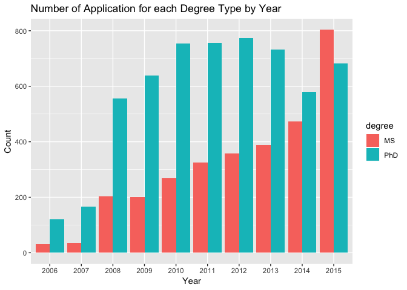 The dataset has official data of report from 2006 to 2015. The application report of three degrees, MFA, MS, PhD increase each year until 2015.

Next, we look at the distribution of applications by season and the counts of each admission decision.

``` r
# bar chart for season
# bar chart includes both Spring semester and Fall semester
grad %>% 
  filter(!is.na(season)) %>%
  ggplot() +
  geom_bar(aes(x = season)) +
  labs(title = "Admission Season")
```

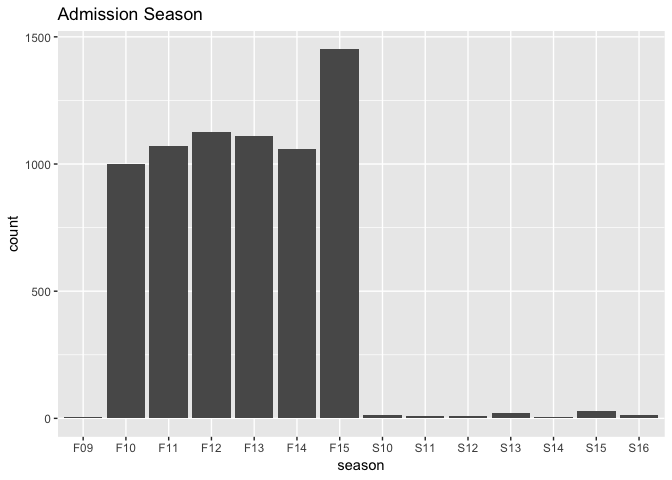

``` r
# bar chart for Fall semester only
grad %>%
  filter(!is.na(season)) %>%
  group_by(fall = str_match(season, "^\\F..")) %>%
  filter(!is.na(fall)) %>%
  ggplot() +
  geom_bar(aes(x = season)) +
  labs(title = "Admission Season (Fall)")
```


``` r
# bar chart for Spring semester only
grad %>%
  filter(!is.na(season)) %>%
  group_by(fall = str_match(season, "^\\F..")) %>%
  filter(is.na(fall)) %>%
  ggplot() +
  geom_bar(aes(x = season)) +
  labs(title = "Admission Season (Spring)")
```

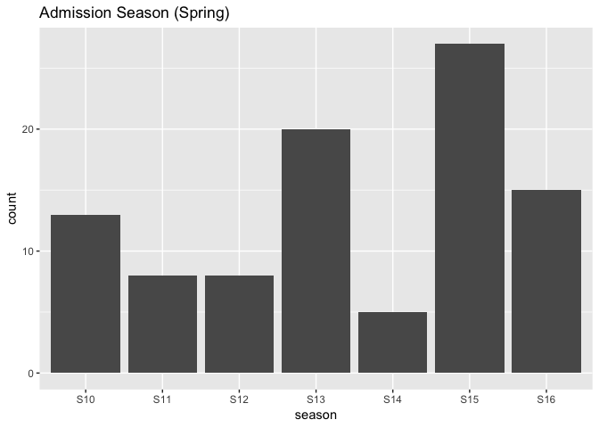

``` r
# bar chart for decision
grad %>%
  filter(!is.na(decision)) %>%
  ggplot() +
  geom_bar(aes(x = decision)) +
  labs(title = "Admission Decision")
```

 We see that the total number of application are signicantly higher for the fall semester than the Spring semester. When looking at the distribution of decisions, the majority of candidates either recieve of report mainly acceptances and rejections, while a few candiates recieve other forms of responses such as waitlist, interview, or "other."

Next, we plot the distribution of GRE test scores, and GPA. Because these is a variable "is\_new\_gre", which distinguished between old and new GRE, we filter for only new GRE scores, as the majority of observations report new GRE scores.

``` r
# GRE Verbal
grad %>% select(gre_verbal ,is_new_gre) %>% 
filter(is_new_gre == TRUE & is.na(gre_verbal)!= TRUE ) %>% ggplot + geom_histogram(aes(gre_verbal)) + 
labs(x ="GRE Verbal Score",
     y ="Count",
     title="Frequencies of GRE Verbal Scores")
```

    ## `stat_bin()` using `bins = 30`. Pick better value with `binwidth`.

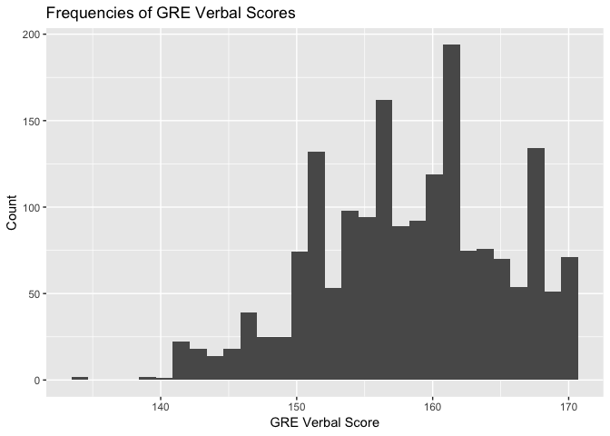

``` r
# GRE quant
grad %>% select(gre_quant ,is_new_gre) %>% 
  filter(is_new_gre == TRUE & is.na(gre_quant)!= TRUE ) %>% ggplot + geom_histogram(aes(gre_quant)) + 
labs(x ="GRE Quant Score",
     y ="Count",
     title="Frequencies of GRE Quant Scores")
```

    ## `stat_bin()` using `bins = 30`. Pick better value with `binwidth`.

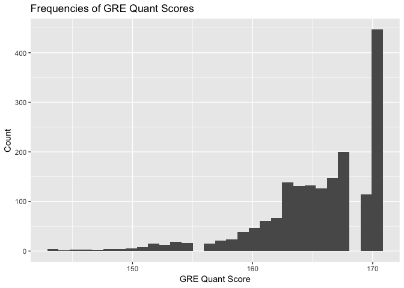

``` r
grad %>% select(gre_quant,gre_verbal,is_new_gre) %>% 
  filter(is_new_gre == TRUE & is.na(gre_quant)!= TRUE & is.na(gre_verbal)!= TRUE ) %>% mutate(totalgre = gre_verbal+gre_quant) %>%
  ggplot + geom_histogram(aes(totalgre)) + 
labs(x ="GRE Quant Score",
     y ="Count",
     title="Frequencies of GRE Total Scores")
```

    ## `stat_bin()` using `bins = 30`. Pick better value with `binwidth`.

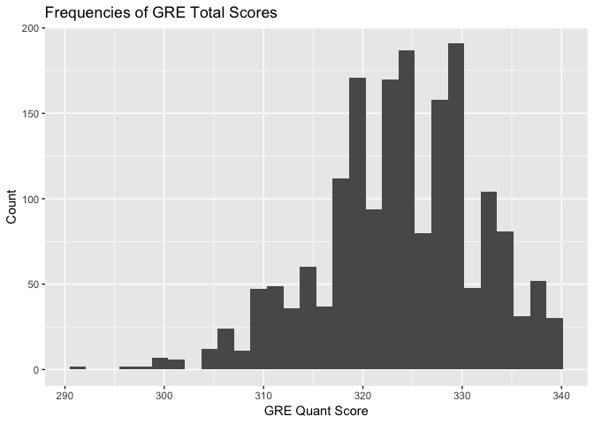

``` r
# GRE writing
grad %>% select(gre_writing ,is_new_gre) %>% 
  filter(is_new_gre == TRUE & is.na(gre_writing)!= TRUE) %>% ggplot + geom_histogram(aes(gre_writing)) + 
labs(x ="GRE Writing Score",
     y ="Count",
     title="Frequencies of GRE Writing Scores")
```

    ## `stat_bin()` using `bins = 30`. Pick better value with `binwidth`.

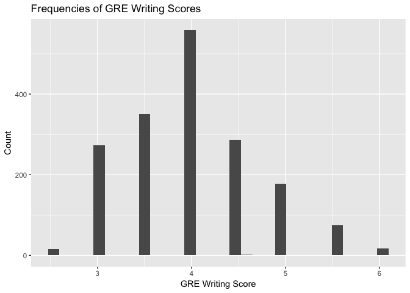 We see from the above histograms that GRE verbal scores range from 130 to 170 with a bell shape. Most of them concentrate 155 - 165. GRE quant score range from 130 to 170 with step like shape. Scores tend to concentrate 160 - 170. GRE writing scores range from 2 to 6 with a bell like shape. Most people get a score of 4.

``` r
grad %>% filter(!is.na(ugrad_gpa) & ugrad_gpa < 4.0) %>% 
  ggplot(aes(ugrad_gpa)) + geom_histogram(bins = 40) + labs(titles = "GPA Distribution")
```

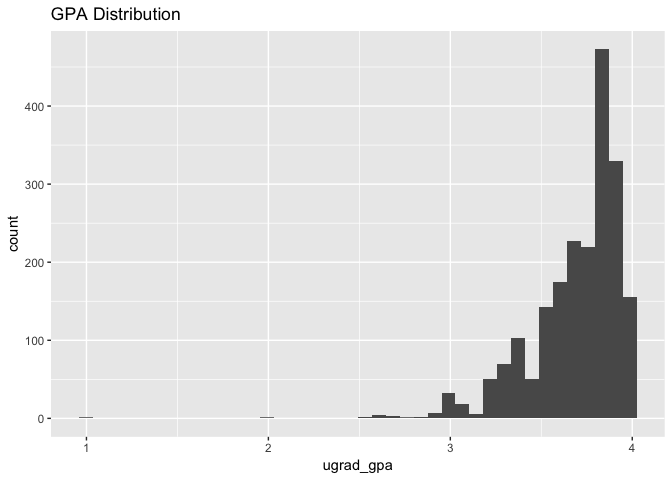 We see that the distribution of GPAs for the observations tend to be left skewed, with the majority of candidates having &gt;3.6 GPA. This is accepted as grad programs tend to look at GPA as a major factor, and students who aim to attend a grad school would likely have higher GPAs.

Lastly, we look at the distribution of student status (internation, US, international with US degree, etc)

``` r
grad %>% filter(!is.na(status)) %>% 
  mutate(count = n()) %>% 
  ggplot(aes(x = status)) + geom_bar() + 
  labs(titles = "Immigration Status") 
```

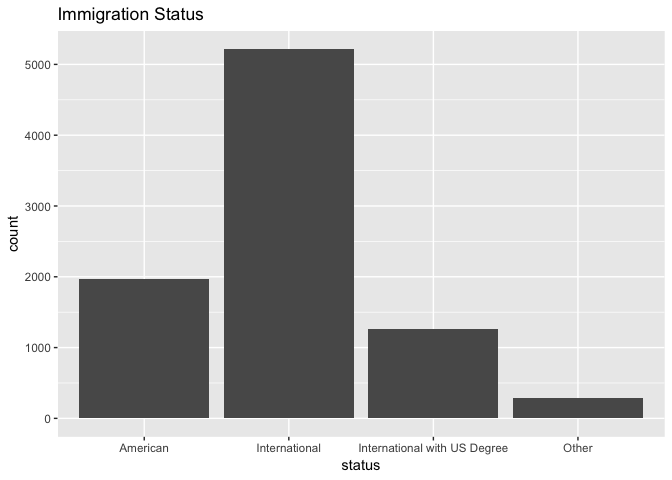 From the chart above, we see that the majority of students applying are American.

Covariation Between Multiple Variables
--------------------------------------

One covariation of interest is the influence of student status (internation, US, etc.) vs admission decision.

``` r
# student identity vs acceptance rate
# table for student status vs decision
(grid <- grad %>%
  filter(!is.na(status), !is.na(decision)) %>%
  group_by(status, decision) %>%
  summarise(count = n()) %>%
  spread(key = decision, value = count))
```

    ## # A tibble: 4 x 6
    ## # Groups:   status [4]
    ##   status                   Accepted Interview Other Rejected `Wait listed`
    ##   <chr>                       <int>     <int> <int>    <int>         <int>
    ## 1 American                      890        60    90      900            21
    ## 2 International                1712       123   333     2987            57
    ## 3 International with US D…      403        35    93      722            11
    ## 4 Other                          29         4   220       28             2

``` r
# bar chart 
grad %>%
  filter(!is.na(decision), !is.na(status)) %>%
  ggplot() +
  geom_bar(aes(status, fill = decision), position = "dodge") +
  labs(title = "Admission Decision vs Status")
```

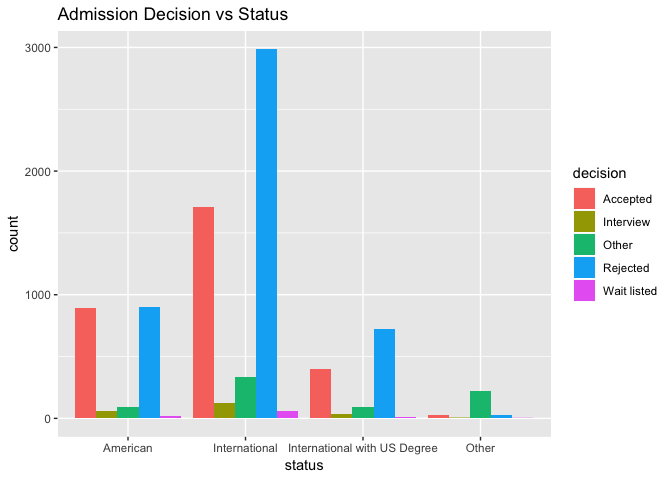

``` r
# acceptance rate based on student status
grid$sum = rowSums(grid[, c("Accepted", "Interview", "Other", "Rejected", "Wait listed")])
grid %>%
  gather('Accepted', 'Interview', 'Other', 'Rejected', 'Wait listed', 
         key = "decision", value = "cases") %>%
  mutate(prop = cases/sum) %>%
  filter(status != "Other") %>%
  ggplot(aes(group = decision, status, prop, color = decision)) + 
  geom_line()
```

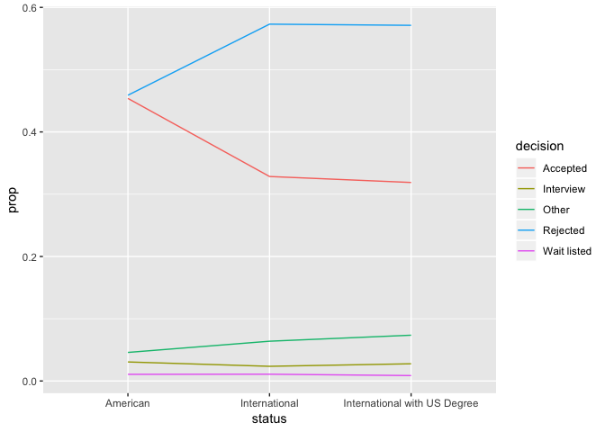 From the charts above, it seems that US based students tend to have higher acceptance rates than international students, and internation with US degree students. The bar chart shows that, for American students, the number of getting accepted is higher than the number of getting rejected. However, for international students and international students with US degree, the number of acceptance is lower than the number of rejection. To further investigate if international students are treated differently, we calculate the decision rate. For each status category, we divide the total number of each admission decision by total number of students to get the decision rate. From the plot we can tell that the proportion of getting accepted is higher for American students than international students, and the proportion of getting rejected is higher for international students with US degree.

Another covariation of interest is the relationship between GPA and GREE scores. For this we summed GRE verbal and GRE quant to get the full GRE score, and created a scatter plot against GPA. We filtered GPA to be less than 4, as GPA of different scales are not comparable.

``` r
grad %>% filter(!is.na(ugrad_gpa|gre_verbal|gre_quant)& ugrad_gpa < 4.1 & ugrad_gpa >1, is_new_gre == TRUE) %>% mutate(GRE_Total = gre_verbal + gre_quant) %>% group_by(uni_name) %>% mutate(mean_gpa = mean(ugrad_gpa), mean_GRE = mean(GRE_Total)) %>% ungroup() %>%
ggplot(aes(x = mean_GRE, y = mean_gpa)) + geom_point(aes(color = "RED", alpha = 0.001)) +
  labs(titles = "Relationship between GPA and GRE Score",
       y = "GPA",
       x = "GRE Score")
```

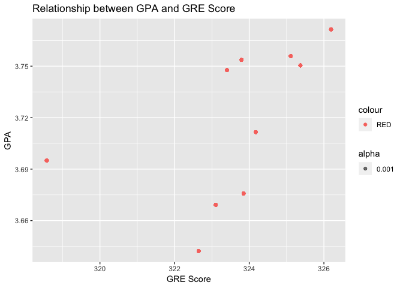

``` r
grad <- grad[complete.cases(grad), ]
```

From the plot above the relationship between GPA and GRE seems to be positively correlated but is not as strong of a relationship as we expected. While most GPAs tend to be on the higher range, GRE scores seem to be more variable across application.

Lastly, to measure the correlation across all continuous variables, we create a scatterplot matrix, and correlation matrix.

``` r
g <- grad[complete.cases(grad),] %>% mutate(acceptance = decision == "Accepted") %>% filter(ugrad_gpa<=4,is_new_gre == TRUE) %>% select(ugrad_gpa, gre_verbal,gre_quant,gre_writing,acceptance) %>% pairs()
```

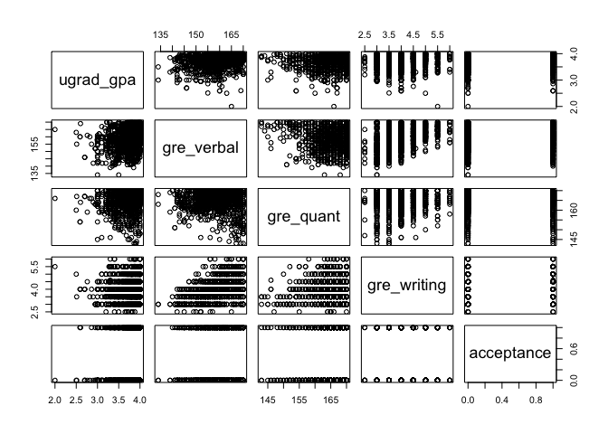 This plot is somewhat unclear due to the verse dense concentration of the datapoints. In the next step, we will likely use regression to model the probability of acceptance based on the different covariates.

Discussion:
-----------

From this exploratory data analysis, we confirm many of the hypotheses that we had going into this project. For example, we confirmed our hypotheses that more students apply in the fall semester than the spring semester and that the majority of students applying (or reported) are American. We confirmed relationships between variables such as GPA and GRE scores. We learned several things as well. For example, we learned the distribution of GPA is left skewed, and GRE scores have an abnormal distribution, with several "spikes" among certain scores. We were surprised to see that American students tended to have higher rates of acceptance than international students.

While this is a very interesting and robust dataset to analyze, there are also several problems we encountered. First, the dataset is not very clean, as it is self-reported. For example, the names of Universities and Majors are not always consistent. For example, some students may write "Boston University (BU)" while others write the name of the specific college at BU such as "Boston University - Metropolitan College." We also noticed that scales of scores and GPA are not always consistent. For example, GPA is most often reported on a 4.0 scale, however, some responses included other scales such as 10 point scale. These will all be problems that we have to work around when going into modeling.

Modelling
---------

``` r
grad <- grad %>% mutate(decision1 = (decision=="Accepted"))
full_mod <- glm(decision1 ~ ugrad_gpa+gre_verbal+gre_quant+gre_writing+status, data = grad, family = binomial)
null_mod <- glm(decision1 ~ 1,data = grad, family=binomial)

backwards = step(full_mod)
```

    ## Start:  AIC=3020.25
    ## decision1 ~ ugrad_gpa + gre_verbal + gre_quant + gre_writing + 
    ##     status
    ## 
    ##               Df Deviance    AIC
    ## - gre_writing  1   3005.4 3019.4
    ## - status       3   3009.8 3019.8
    ## <none>             3004.2 3020.2
    ## - gre_quant    1   3006.3 3020.3
    ## - gre_verbal   1   3008.3 3022.3
    ## - ugrad_gpa    1   3016.0 3030.0
    ## 
    ## Step:  AIC=3019.45
    ## decision1 ~ ugrad_gpa + gre_verbal + gre_quant + status
    ## 
    ##              Df Deviance    AIC
    ## <none>            3005.4 3019.4
    ## - gre_quant   1   3007.7 3019.7
    ## - gre_verbal  1   3010.0 3022.0
    ## - status      3   3015.6 3023.6
    ## - ugrad_gpa   1   3017.7 3029.7

``` r
summary(backwards)
```

    ## 
    ## Call:
    ## glm(formula = decision1 ~ ugrad_gpa + gre_verbal + gre_quant + 
    ##     status, family = binomial, data = grad)
    ## 
    ## Deviance Residuals: 
    ##     Min       1Q   Median       3Q      Max  
    ## -1.8197  -1.0338  -0.9664   1.2799   1.5041  
    ## 
    ## Coefficients:
    ##                                      Estimate Std. Error z value Pr(>|z|)
    ## (Intercept)                        -1.1885083  0.3130485  -3.797 0.000147
    ## ugrad_gpa                           0.2599680  0.0793691   3.275 0.001055
    ## gre_verbal                          0.0011804  0.0005543   2.130 0.033202
    ## gre_quant                          -0.0006523  0.0004332  -1.506 0.132149
    ## statusInternational                -0.3056129  0.0980664  -3.116 0.001831
    ## statusInternational with US Degree -0.1983914  0.1507843  -1.316 0.188265
    ## statusOther                        -0.5769871  0.5550437  -1.040 0.298556
    ##                                       
    ## (Intercept)                        ***
    ## ugrad_gpa                          ** 
    ## gre_verbal                         *  
    ## gre_quant                             
    ## statusInternational                ** 
    ## statusInternational with US Degree    
    ## statusOther                           
    ## ---
    ## Signif. codes:  0 '***' 0.001 '**' 0.01 '*' 0.05 '.' 0.1 ' ' 1
    ## 
    ## (Dispersion parameter for binomial family taken to be 1)
    ## 
    ##     Null deviance: 3034.7  on 2221  degrees of freedom
    ## Residual deviance: 3005.5  on 2215  degrees of freedom
    ## AIC: 3019.5
    ## 
    ## Number of Fisher Scoring iterations: 4
