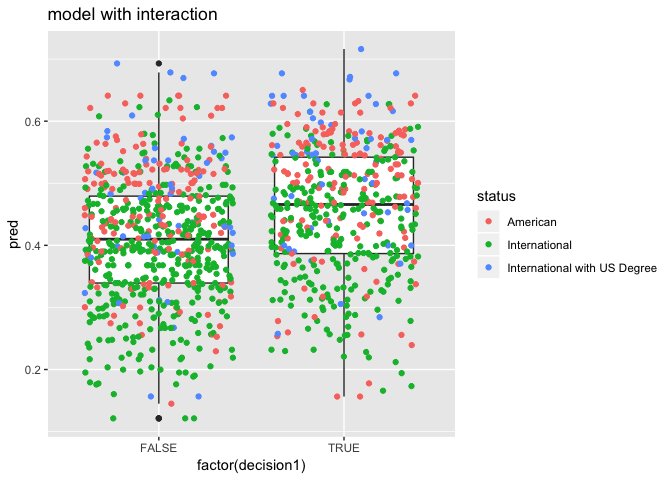
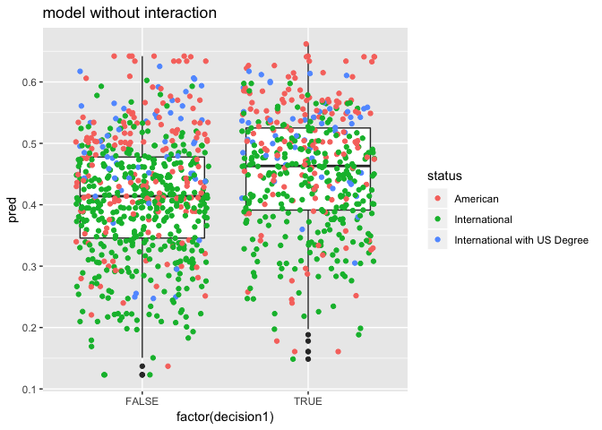
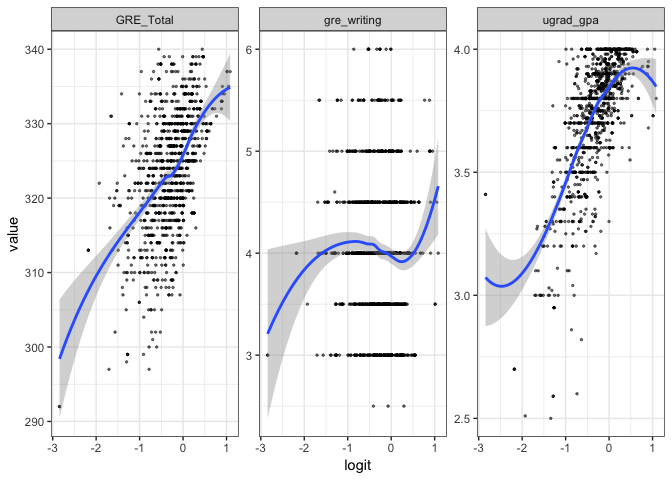
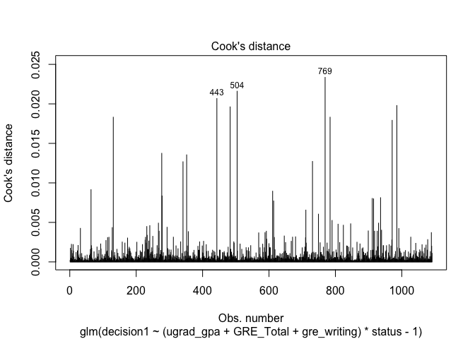
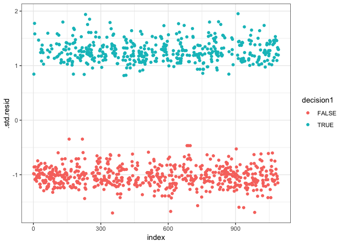
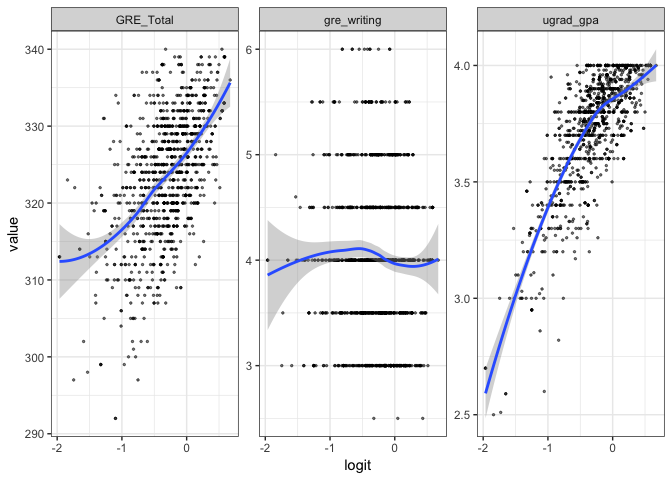
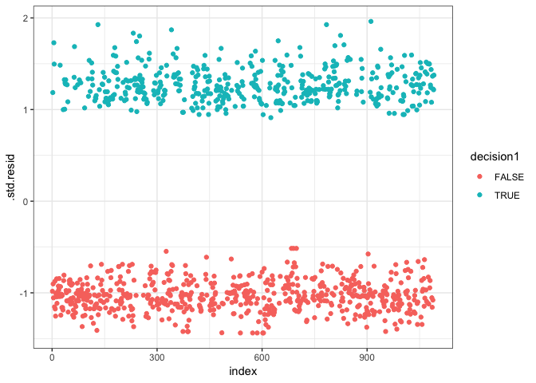

deliverable\#2
================

Data Importing
==============

``` r
library(tidyverse)
```

    ## ── Attaching packages ──────────────────────────────────────────────────────────────────────────── tidyverse 1.2.1 ──

    ## ✔ ggplot2 3.1.0     ✔ purrr   0.2.5
    ## ✔ tibble  2.0.1     ✔ dplyr   0.7.8
    ## ✔ tidyr   0.8.2     ✔ stringr 1.3.1
    ## ✔ readr   1.3.1     ✔ forcats 0.3.0

    ## ── Conflicts ─────────────────────────────────────────────────────────────────────────────── tidyverse_conflicts() ──
    ## ✖ dplyr::filter() masks stats::filter()
    ## ✖ dplyr::lag()    masks stats::lag()

``` r
#library(plotly)
(grad <- read_csv("data/grad.csv",
    col_types = cols_only( 
      uni_name=col_character(),
      major=col_character(),
      degree=col_character(),
      season=col_character(),
      decision=col_character(),
      decision_date=col_character(),
      decision_timestamp=col_double(),
      ugrad_gpa=col_double(),
      gre_verbal=col_double(),
      gre_quant=col_double(),
      gre_writing=col_double(),
      is_new_gre=col_logical(),
      status=col_character(),
      comments=col_character())))
```

    ## # A tibble: 345,303 x 14
    ##    uni_name major degree season decision decision_date decision_timest…
    ##    <chr>    <chr> <chr>  <chr>  <chr>    <chr>                    <dbl>
    ##  1 Univers… Ms. … MS     S16    Accepted (5, 11, 2015)       1446699600
    ##  2 Vanderb… Educ… MS     F16    Other    <NA>                        NA
    ##  3 Univers… Publ… MS     F16    Accepted (16, 11, 201…       1447650000
    ##  4 Tufts U… Comp… PhD    S16    Accepted (16, 11, 201…       1447650000
    ##  5 Univers… Theo… MS     F16    Accepted (16, 11, 201…       1447650000
    ##  6 Univers… Mast… MS     S16    Rejected (14, 11, 201…       1447477200
    ##  7 Univers… Publ… MS     F16    Accepted (12, 11, 201…       1447304400
    ##  8 Tufts U… MALD  MS     S16    Accepted (7, 11, 2015)       1446872400
    ##  9 New Yor… Fina… MS     S16    Accepted (15, 11, 201…       1447563600
    ## 10 Appalac… Comm… MS     S16    Accepted (13, 11, 201…       1447390800
    ## # … with 345,293 more rows, and 7 more variables: ugrad_gpa <dbl>,
    ## #   gre_verbal <dbl>, gre_quant <dbl>, gre_writing <dbl>,
    ## #   is_new_gre <lgl>, status <chr>, comments <chr>

``` r
problems(grad)
```

    ## [1] row      col      expected actual  
    ## <0 rows> (or 0-length row.names)

Data Cleaning
=============

``` r
grad <- grad %>% filter(str_detect(major, "Computer")|str_detect(major, "computer"))

#,degree=="PhD") %>% mutate(research=(str_detect(comments, "research")|str_detect(comments, "Research"))&!str_detect(comments, "No research")&!str_detect(comments, "no research")&!is.na(comments))
grad %>% group_by(uni_name) %>% count(uni_name) %>% arrange(desc(n))
```

    ## # A tibble: 416 x 2
    ## # Groups:   uni_name [416]
    ##    uni_name                                            n
    ##    <chr>                                           <int>
    ##  1 Carnegie Mellon University (CMU)                 1414
    ##  2 Georgia Institute Of Technology (GTech)           985
    ##  3 University Of California, San Diego (UCSD)        954
    ##  4 University Of Illinois, Urbana-Champaign (UIUC)   954
    ##  5 Stanford University                               914
    ##  6 University Of California, Berkeley (UCB)          844
    ##  7 Purdue University                                 745
    ##  8 University Of Washington, Seattle (UW)            713
    ##  9 University Of Texas, Austin (UT Austin)           706
    ## 10 Cornell University                                674
    ## # … with 406 more rows

``` r
grad %>% group_by(uni_name,major) %>% count(uni_name, major) %>% arrange(desc(n))
```

    ## # A tibble: 2,749 x 3
    ## # Groups:   uni_name, major [2,749]
    ##    uni_name                                        major                n
    ##    <chr>                                           <chr>            <int>
    ##  1 Carnegie Mellon University (CMU)                Computer Science   776
    ##  2 Stanford University                             Computer Science   765
    ##  3 Georgia Institute Of Technology (GTech)         Computer Science   610
    ##  4 Columbia University                             Computer Science   585
    ##  5 University Of Illinois, Urbana-Champaign (UIUC) Computer Science   582
    ##  6 University Of Washington, Seattle (UW)          Computer Science   581
    ##  7 University Of California, San Diego (UCSD)      Computer Science   530
    ##  8 University Of California, Berkeley (UCB)        Computer Science   521
    ##  9 University Of California, Los Angeles (UCLA)    Computer Science   498
    ## 10 Cornell University                              Computer Science   478
    ## # … with 2,739 more rows

Top 10 Dataset
==============

``` r
grad1 <- grad %>% group_by(uni_name) %>%filter(decision == "Accepted") %>% count(uni_name) %>% arrange(desc(n)) 
grad2 <- grad %>% group_by(uni_name) %>% count(uni_name) %>% arrange(desc(n))
colnames(grad1)[2] = "accepted"
(top10 <-merge(grad1,grad2,by =("uni_name")) %>% mutate(rate = accepted/n) %>% filter(n>100) %>% arrange(desc(n)) %>% head(10))
```

    ##                                           uni_name accepted    n      rate
    ## 1                 Carnegie Mellon University (CMU)      523 1414 0.3698727
    ## 2          Georgia Institute Of Technology (GTech)      413  985 0.4192893
    ## 3       University Of California, San Diego (UCSD)      349  954 0.3658281
    ## 4  University Of Illinois, Urbana-Champaign (UIUC)      367  954 0.3846960
    ## 5                              Stanford University      245  914 0.2680525
    ## 6         University Of California, Berkeley (UCB)      155  844 0.1836493
    ## 7                                Purdue University      335  745 0.4496644
    ## 8           University Of Washington, Seattle (UW)      167  713 0.2342216
    ## 9          University Of Texas, Austin (UT Austin)      282  706 0.3994334
    ## 10                              Cornell University      253  674 0.3753709

``` r
grad3 <- grad %>% group_by(uni_name,major) %>% filter(decision == "Accepted") %>% count(uni_name,major) %>% arrange(desc(n)) 
grad4 <- grad %>% group_by(uni_name,major) %>% count(uni_name,major) %>% arrange(desc(n))
colnames(grad3)[3] = "accepted"
merge(grad3,grad4,by=c("uni_name","major")) %>% mutate(rate = accepted/n) %>% arrange(desc(n)) %>% head(10)
```

    ##                                           uni_name            major
    ## 1                 Carnegie Mellon University (CMU) Computer Science
    ## 2                              Stanford University Computer Science
    ## 3          Georgia Institute Of Technology (GTech) Computer Science
    ## 4                              Columbia University Computer Science
    ## 5  University Of Illinois, Urbana-Champaign (UIUC) Computer Science
    ## 6           University Of Washington, Seattle (UW) Computer Science
    ## 7       University Of California, San Diego (UCSD) Computer Science
    ## 8         University Of California, Berkeley (UCB) Computer Science
    ## 9     University Of California, Los Angeles (UCLA) Computer Science
    ## 10                              Cornell University Computer Science
    ##    accepted   n      rate
    ## 1       238 776 0.3067010
    ## 2       198 765 0.2588235
    ## 3       247 610 0.4049180
    ## 4       216 585 0.3692308
    ## 5       238 582 0.4089347
    ## 6       132 581 0.2271945
    ## 7       192 530 0.3622642
    ## 8        83 521 0.1593090
    ## 9       194 498 0.3895582
    ## 10      164 478 0.3430962

``` r
merge(grad1,grad2,by =("uni_name")) %>% mutate(rate = accepted/n) %>% filter(uni_name == "Boston University (BU)")
```

    ##                 uni_name accepted   n      rate
    ## 1 Boston University (BU)       79 184 0.4293478

``` r
merge(grad3,grad4,by=c("uni_name","major")) %>% mutate(rate = accepted/n) %>% filter(uni_name == "Boston University (BU)") %>% arrange(rate) %>% head(10)
```

    ##                  uni_name                                     major
    ## 1  Boston University (BU) (ECE) Electrical And Computer Engineering
    ## 2  Boston University (BU)                          Computer Science
    ## 3  Boston University (BU)       Electrical And Computer Engineering
    ## 4  Boston University (BU)   ECE (Electrical & Computer Engineering)
    ## 5  Boston University (BU) ECE (Electrical And Computer Engineering)
    ## 6  Boston University (BU)  ECE(Electrical And Computer Engineering)
    ## 7  Boston University (BU) Electrical And Computer Engineering (ECE)
    ## 8  Boston University (BU)                      Computer Engineering
    ## 9  Boston University (BU) Electrical and Computer Engineering (ECE)
    ## 10 Boston University (BU)         Electrical & Computer Engineering
    ##    accepted   n      rate
    ## 1         2   9 0.2222222
    ## 2        38 101 0.3762376
    ## 3         6  13 0.4615385
    ## 4         5  10 0.5000000
    ## 5         2   4 0.5000000
    ## 6         1   2 0.5000000
    ## 7         1   2 0.5000000
    ## 8        10  18 0.5555556
    ## 9         5   9 0.5555556
    ## 10        4   6 0.6666667

``` r
#filter for top 10 schools by ranking
top10 <- head(top10,10)$uni_name 
grad <- subset(grad, uni_name %in% top10)
#filter
grad <- grad[complete.cases(grad), ]
```

Modeling
========

``` r
grad <- grad[complete.cases(grad[,-14]), ] %>% filter(is_new_gre == TRUE, ugrad_gpa <=4,status!="Other")%>% mutate(season1 = str_sub(season,1,1), decision1 = (decision=="Accepted"), GRE_Total = gre_verbal + gre_quant)
# models
full_mod_int <- glm(decision1 ~ (ugrad_gpa+GRE_Total+gre_writing)*status -1, data = grad, family = binomial)
(gradmodel_int <- step(full_mod_int))
```

    ## Start:  AIC=1459.38
    ## decision1 ~ (ugrad_gpa + GRE_Total + gre_writing) * status - 
    ##     1
    ## 
    ##                      Df Deviance    AIC
    ## - ugrad_gpa:status    2   1436.5 1456.5
    ## - GRE_Total:status    2   1437.5 1457.5
    ## - gre_writing:status  2   1438.4 1458.4
    ## <none>                    1435.4 1459.4
    ## 
    ## Step:  AIC=1456.54
    ## decision1 ~ ugrad_gpa + GRE_Total + gre_writing + status + GRE_Total:status + 
    ##     gre_writing:status - 1
    ## 
    ##                      Df Deviance    AIC
    ## - GRE_Total:status    2   1438.4 1454.4
    ## - gre_writing:status  2   1439.3 1455.3
    ## <none>                    1436.5 1456.5
    ## - ugrad_gpa           1   1454.0 1472.0
    ## 
    ## Step:  AIC=1454.44
    ## decision1 ~ ugrad_gpa + GRE_Total + gre_writing + status + gre_writing:status - 
    ##     1
    ## 
    ##                      Df Deviance    AIC
    ## <none>                    1438.4 1454.4
    ## - gre_writing:status  2   1444.7 1456.7
    ## - GRE_Total           1   1449.8 1463.8
    ## - ugrad_gpa           1   1455.9 1469.9

    ## 
    ## Call:  glm(formula = decision1 ~ ugrad_gpa + GRE_Total + gre_writing + 
    ##     status + gre_writing:status - 1, family = binomial, data = grad)
    ## 
    ## Coefficients:
    ##                                      ugrad_gpa  
    ##                                        1.14664  
    ##                                      GRE_Total  
    ##                                        0.03128  
    ##                                    gre_writing  
    ##                                       -0.26817  
    ##                                 statusAmerican  
    ##                                      -13.40324  
    ##                            statusInternational  
    ##                                      -12.78241  
    ##             statusInternational with US Degree  
    ##                                      -15.54470  
    ##                gre_writing:statusInternational  
    ##                                       -0.25273  
    ## gre_writing:statusInternational with US Degree  
    ##                                        0.54078  
    ## 
    ## Degrees of Freedom: 1091 Total (i.e. Null);  1083 Residual
    ## Null Deviance:       1512 
    ## Residual Deviance: 1438  AIC: 1454

``` r
summary(gradmodel_int)
```

    ## 
    ## Call:
    ## glm(formula = decision1 ~ ugrad_gpa + GRE_Total + gre_writing + 
    ##     status + gre_writing:status - 1, family = binomial, data = grad)
    ## 
    ## Deviance Residuals: 
    ##     Min       1Q   Median       3Q      Max  
    ## -1.5368  -1.0575  -0.8203   1.2008   1.9261  
    ## 
    ## Coefficients:
    ##                                                  Estimate Std. Error
    ## ugrad_gpa                                        1.146643   0.283057
    ## GRE_Total                                        0.031278   0.009388
    ## gre_writing                                     -0.268174   0.189752
    ## statusAmerican                                 -13.403241   2.973278
    ## statusInternational                            -12.782405   2.852552
    ## statusInternational with US Degree             -15.544697   3.081698
    ## gre_writing:statusInternational                 -0.252731   0.225536
    ## gre_writing:statusInternational with US Degree   0.540781   0.358197
    ##                                                z value Pr(>|z|)    
    ## ugrad_gpa                                        4.051 5.10e-05 ***
    ## GRE_Total                                        3.332 0.000863 ***
    ## gre_writing                                     -1.413 0.157571    
    ## statusAmerican                                  -4.508 6.55e-06 ***
    ## statusInternational                             -4.481 7.43e-06 ***
    ## statusInternational with US Degree              -5.044 4.55e-07 ***
    ## gre_writing:statusInternational                 -1.121 0.262468    
    ## gre_writing:statusInternational with US Degree   1.510 0.131112    
    ## ---
    ## Signif. codes:  0 '***' 0.001 '**' 0.01 '*' 0.05 '.' 0.1 ' ' 1
    ## 
    ## (Dispersion parameter for binomial family taken to be 1)
    ## 
    ##     Null deviance: 1512.4  on 1091  degrees of freedom
    ## Residual deviance: 1438.4  on 1083  degrees of freedom
    ## AIC: 1454.4
    ## 
    ## Number of Fisher Scoring iterations: 4

``` r
full_mod <- glm(decision1 ~ ugrad_gpa+GRE_Total+gre_writing+status-1, data = grad, family = binomial)
(gradmodel <- step(full_mod))
```

    ## Start:  AIC=1456.66
    ## decision1 ~ ugrad_gpa + GRE_Total + gre_writing + status - 1
    ## 
    ##               Df Deviance    AIC
    ## <none>             1444.7 1456.7
    ## - gre_writing  1   1455.5 1465.5
    ## - GRE_Total    1   1455.7 1465.7
    ## - ugrad_gpa    1   1462.8 1472.8
    ## - status       3   1477.0 1483.0

    ## 
    ## Call:  glm(formula = decision1 ~ ugrad_gpa + GRE_Total + gre_writing + 
    ##     status - 1, family = binomial, data = grad)
    ## 
    ## Coefficients:
    ##                          ugrad_gpa                           GRE_Total  
    ##                            1.16848                             0.03074  
    ##                        gre_writing                      statusAmerican  
    ##                           -0.35978                           -12.89275  
    ##                statusInternational  statusInternational with US Degree  
    ##                          -13.30241                           -12.98166  
    ## 
    ## Degrees of Freedom: 1091 Total (i.e. Null);  1085 Residual
    ## Null Deviance:       1512 
    ## Residual Deviance: 1445  AIC: 1457

``` r
summary(gradmodel)
```

    ## 
    ## Call:
    ## glm(formula = decision1 ~ ugrad_gpa + GRE_Total + gre_writing + 
    ##     status - 1, family = binomial, data = grad)
    ## 
    ## Deviance Residuals: 
    ##     Min       1Q   Median       3Q      Max  
    ## -1.4334  -1.0585  -0.8327   1.2071   1.9526  
    ## 
    ## Coefficients:
    ##                                      Estimate Std. Error z value Pr(>|z|)
    ## ugrad_gpa                            1.168482   0.283037   4.128 3.65e-05
    ## GRE_Total                            0.030744   0.009342   3.291 0.000998
    ## gre_writing                         -0.359779   0.110128  -3.267 0.001087
    ## statusAmerican                     -12.892745   2.846590  -4.529 5.92e-06
    ## statusInternational                -13.302409   2.834117  -4.694 2.68e-06
    ## statusInternational with US Degree -12.981663   2.846232  -4.561 5.09e-06
    ##                                       
    ## ugrad_gpa                          ***
    ## GRE_Total                          ***
    ## gre_writing                        ** 
    ## statusAmerican                     ***
    ## statusInternational                ***
    ## statusInternational with US Degree ***
    ## ---
    ## Signif. codes:  0 '***' 0.001 '**' 0.01 '*' 0.05 '.' 0.1 ' ' 1
    ## 
    ## (Dispersion parameter for binomial family taken to be 1)
    ## 
    ##     Null deviance: 1512.4  on 1091  degrees of freedom
    ## Residual deviance: 1444.7  on 1085  degrees of freedom
    ## AIC: 1456.7
    ## 
    ## Number of Fisher Scoring iterations: 4

``` r
null_mod <- glm(decision1 ~ 1,data = grad, family=binomial)

grad %>%
 mutate(pred = predict(gradmodel_int,
 type = "response")) %>%
 ggplot(aes(factor(decision1), pred)) +
 geom_boxplot() +
 geom_point(aes(color = status),
 position = "jitter") +
 labs(title = "model with interaction")
```



``` r
grad %>%
 mutate(pred = predict(gradmodel,
 type = "response")) %>%
 ggplot(aes(factor(decision1), pred)) +
 geom_boxplot() +
 geom_point(aes(color = status),
 position = "jitter") +
 labs(title = "model without interaction")
```



``` r
gg_int <- grad %>%
 mutate(pred = predict(gradmodel_int,
 type = "response")) #%>% select(decision, pred)
gg <- grad %>%
 mutate(pred = predict(gradmodel,
 type = "response")) #%>% select(decision, pred)
```

For the model that includes interaction: The regression coefficient for ugrad\_gpa is $\\hat{\\beta\_(ugradgpa)} = 1.146643$ meaning that for a one-unit increase in undergraduate gpa the logit-transformed probability of getting accepted to the program will increase by 1.15. Predictor GRE\_Total has a coefficient $\\hat{\\beta\_(GREtotal)} = 0.031106$, showing that for a one-unit increase in GRE total scores the log odds will increase by 0.03. We also include categorical variable status represneting applicant's identity. The corresponding coefficient $\\hat{\\beta\_(American)} = -13.403241$ shows that if the applicant is an American students, the log odds will decrease by 13.4, holding all other independent variables constant, $\\hat{\\beta\_(International)} = -12.782405$ shows the change in log odds given the student is an international student, and $\\hat{\\beta\_(USdegree)} = -15.544697$ shows the change in log odds given the student is an international student with a US degree.

$\\hat{\\beta\_(GREwriting)} = -0.267686$ is the regression coefficients for GRE writing score, and $\\hat{\\beta\_(GREwriting:International)} = -0.252731$ and $\\hat{\\beta\_(GREwriting:USdegree)} = 0.540781$ are the coefficients of GRE writing scores with respect to students status. However, the hypothesis tests for coefficient indicates that those terms would not significantly impact the prediction of our model.

``` r
# prediction of model with interaction term
(mod_coef <- coef(gradmodel_int))
```

    ##                                      ugrad_gpa 
    ##                                     1.14664296 
    ##                                      GRE_Total 
    ##                                     0.03127823 
    ##                                    gre_writing 
    ##                                    -0.26817442 
    ##                                 statusAmerican 
    ##                                   -13.40324104 
    ##                            statusInternational 
    ##                                   -12.78240546 
    ##             statusInternational with US Degree 
    ##                                   -15.54469677 
    ##                gre_writing:statusInternational 
    ##                                    -0.25273087 
    ## gre_writing:statusInternational with US Degree 
    ##                                     0.54078123

``` r
prediction_american <- mod_coef[1]*mean(grad$ugrad_gpa)+mod_coef[2]*mean(grad$GRE_Total)+mod_coef[3]*mean(grad$gre_writing)+mod_coef[4]
exp(prediction_american) / (1 + exp(prediction_american))
```

    ## ugrad_gpa 
    ## 0.4785392

``` r
prediction_inter <- mod_coef[1]*mean(grad$ugrad_gpa)+mod_coef[2]*mean(grad$GRE_Total)+mod_coef[3]*mean(grad$gre_writing)+mod_coef[5]+mod_coef[7]
exp(prediction_inter) / (1 + exp(prediction_inter))
```

    ## ugrad_gpa 
    ## 0.5700877

``` r
prediction_inter_us <- mod_coef[1]*mean(grad$ugrad_gpa)+mod_coef[2]*mean(grad$GRE_Total)+mod_coef[3]*mean(grad$gre_writing)+mod_coef[6]+mod_coef[8]
exp(prediction_inter_us) / (1 + exp(prediction_inter_us))
```

    ## ugrad_gpa 
    ## 0.1562274

Using our model that includes the interaction between student's status and GRE writing score, we use mean GPA, GRE total score and writing score to compute the probability of a student getting accepted. There's 47.9% chance that the student will be admitted to the program if the student is an American student, and 57% and 15.6% respectively if the student is an international student or international student with a US degree.

For the model that does not include interaction terms: The regression coefficient for ugrad\_gpa is $\\hat{\\beta\_(ugradgpa)} = 1.168482$, which indicates that for a one-unit increase in undergraduate gpa the logit-transformed probability of getting accepted to the program will increase by 1.15. $\\hat{\\beta\_(GREtotal)} = 0.030744$ is the coefficient for predictor GRE\_Total showing that for a one-unit increase in GRE total scores the log odds will increase by 0.03. $\\hat{\\beta\_(GREwriting)} = -0.359779$ shows that GRE writing score is negatively related with probability of getting admited, and for every one unit increase in writing score leads to a 0.36 drop in log odds. If the applicant is an American students, our model predicts a drop equals to $\\hat{\\beta\_(American)} = -12.892745$ in the log odds, holding all other independent variables constant. If the aaplicant is a international student, log odds decreases by $\\hat{\\beta\_(International)} = -13.302409$, and if the student has earned a US degree, log odds drops by $\\hat{\\beta\_(USdegree)} = -12.981663$.

``` r
# prediction of model without interaction term
(mod_coef_n <- coef(gradmodel))
```

    ##                          ugrad_gpa                          GRE_Total 
    ##                          1.1684823                          0.0307436 
    ##                        gre_writing                     statusAmerican 
    ##                         -0.3597787                        -12.8927451 
    ##                statusInternational statusInternational with US Degree 
    ##                        -13.3024091                        -12.9816626

``` r
prediction_american_n <- mod_coef_n[1]*mean(grad$ugrad_gpa)+mod_coef_n[2]*mean(grad$GRE_Total)+mod_coef_n[3]*mean(grad$gre_writing)+mod_coef_n[4]
exp(prediction_american_n) / (1 + exp(prediction_american_n))
```

    ## ugrad_gpa 
    ## 0.4909546

``` r
prediction_inter_n <- mod_coef_n[1]*mean(grad$ugrad_gpa)+mod_coef_n[2]*mean(grad$GRE_Total)+mod_coef_n[3]*mean(grad$gre_writing)+mod_coef_n[5]
exp(prediction_inter_n) / (1 + exp(prediction_inter_n))
```

    ## ugrad_gpa 
    ##  0.390348

``` r
prediction_inter_us_n <- mod_coef_n[1]*mean(grad$ugrad_gpa)+mod_coef_n[2]*mean(grad$GRE_Total)+mod_coef_n[3]*mean(grad$gre_writing)+mod_coef_n[6]
exp(prediction_inter_us_n) / (1 + exp(prediction_inter_us_n))
```

    ## ugrad_gpa 
    ##  0.468765

Using same mean level GPA, GRE total score and writing score, our simple logistic model predicts that the probability of an American student getting accepted to the program is 49.1% and the probaility for international student without a US degree and those with a US degree is 39% and 46.9% respectively.

``` r
# check assumptions
# 1. outcome is binary
# 2. linear relationship between the logit of the outcome and each predictor variables
# 3. no influential values
# 4. no high intercorrelations
library(broom)
p_int <- predict(full_mod_int, type = "response")
grad_mod_int <- grad %>%
  select_if(is.numeric) %>% select(-1, -gre_quant, -gre_verbal)
predictors_int <- colnames(grad_mod_int) 
grad_mod_int <- (grad_mod_int %>%
  mutate(logit = log(p_int/(1-p_int))) %>%
  gather(key = "predictors_int", value = "value", -logit))
# check linearity between x and logit of the outcome
ggplot(grad_mod_int, aes(logit, value))+
  geom_point(size = 0.5, alpha = 0.5) +
  geom_smooth(method = "loess") + 
  theme_bw() + 
  facet_wrap(~predictors_int, scales = "free_y")
```



``` r
# check influencial values
# top3 largest values
plot(full_mod_int, which = 4, id.n = 3)
```



``` r
# plot the standardized residual
data_int <- augment(full_mod_int) %>% 
  mutate(index = 1:n())
data_int %>% top_n(3, .cooksd)
```

    ## # A tibble: 3 x 13
    ##   decision1 ugrad_gpa GRE_Total gre_writing status  .fitted .se.fit .resid
    ##   <lgl>         <dbl>     <dbl>       <dbl> <chr>     <dbl>   <dbl>  <dbl>
    ## 1 TRUE           3.17       324         3.5 Inter… -0.299     0.749   1.31
    ## 2 TRUE           3.2        324         3   Inter… -0.325     0.755   1.32
    ## 3 FALSE          3.3        325         5.5 Inter… -0.00218   0.863  -1.18
    ## # … with 5 more variables: .hat <dbl>, .sigma <dbl>, .cooksd <dbl>,
    ## #   .std.resid <dbl>, index <int>

``` r
ggplot(data_int, aes(index, .std.resid)) + 
  geom_point(aes(color = decision1)) +
  theme_bw()
```



``` r
# if standardized residual is greater than 3 -> Influential
data_int %>% 
  filter(abs(.std.resid) > 3)
```

    ## # A tibble: 0 x 13
    ## # … with 13 variables: decision1 <lgl>, ugrad_gpa <dbl>, GRE_Total <dbl>,
    ## #   gre_writing <dbl>, status <chr>, .fitted <dbl>, .se.fit <dbl>,
    ## #   .resid <dbl>, .hat <dbl>, .sigma <dbl>, .cooksd <dbl>,
    ## #   .std.resid <dbl>, index <int>

``` r
#Correlation matrix
library(Hmisc)
```

    ## Loading required package: lattice

    ## Loading required package: survival

    ## Loading required package: Formula

    ## 
    ## Attaching package: 'Hmisc'

    ## The following objects are masked from 'package:dplyr':
    ## 
    ##     src, summarize

    ## The following objects are masked from 'package:base':
    ## 
    ##     format.pval, units

``` r
grad_noNA = grad %>% filter(is.na(ugrad_gpa) == FALSE, is.na(gre_verbal) ==FALSE,  is.na(gre_quant) ==FALSE, is.na(gre_writing) ==FALSE)
(grad_noNA = grad_noNA %>% mutate(gre_total = gre_verbal + gre_quant))
```

    ## # A tibble: 1,091 x 18
    ##    uni_name major degree season decision decision_date decision_timest…
    ##    <chr>    <chr> <chr>  <chr>  <chr>    <chr>                    <dbl>
    ##  1 Purdue … (Com… MS     S16    Rejected (2, 11, 2015)       1446440400
    ##  2 Univers… Comp… MS     S16    Accepted (28, 9, 2015)       1443412800
    ##  3 Univers… (Com… MS     F15    Rejected (24, 5, 2015)       1432440000
    ##  4 Carnegi… ( EC… MS     F15    Other    (27, 6, 2015)       1435377600
    ##  5 Carnegi… Elec… MS     F15    Accepted (2, 6, 2015)        1433217600
    ##  6 Univers… Elec… MS     F15    Accepted (14, 4, 2015)       1428984000
    ##  7 Univers… Comp… PhD    F15    Other    (20, 4, 2015)       1429502400
    ##  8 Cornell… Comp… MS     F15    Rejected (7, 4, 2015)        1428379200
    ##  9 Univers… Comp… PhD    F15    Other    (16, 4, 2015)       1429156800
    ## 10 Univers… Comp… PhD    F15    Other    (16, 4, 2015)       1429156800
    ## # … with 1,081 more rows, and 11 more variables: ugrad_gpa <dbl>,
    ## #   gre_verbal <dbl>, gre_quant <dbl>, gre_writing <dbl>,
    ## #   is_new_gre <lgl>, status <chr>, comments <chr>, season1 <chr>,
    ## #   decision1 <lgl>, GRE_Total <dbl>, gre_total <dbl>

``` r
my_data1 <- grad_noNA[, c(8,11,14)]
my_data2 <- grad_noNA[, c(8,9,10,11)]
#(rcorr(as.matrix(my_data)))
#This is the correlation matrix for ugrad_gpa, gre_verbal, gre_quant, gre_writing
(rcorr(as.matrix(my_data2)))
```

    ##             ugrad_gpa gre_verbal gre_quant gre_writing
    ## ugrad_gpa        1.00       0.19      0.18        0.13
    ## gre_verbal       0.19       1.00     -0.08        0.54
    ## gre_quant        0.18      -0.08      1.00        0.03
    ## gre_writing      0.13       0.54      0.03        1.00
    ## 
    ## n= 1091 
    ## 
    ## 
    ## P
    ##             ugrad_gpa gre_verbal gre_quant gre_writing
    ## ugrad_gpa             0.0000     0.0000    0.0000     
    ## gre_verbal  0.0000               0.0069    0.0000     
    ## gre_quant   0.0000    0.0069               0.3114     
    ## gre_writing 0.0000    0.0000     0.3114

``` r
p <- predict(full_mod, type = "response")
grad_mod <- grad %>%
  select_if(is.numeric) %>% select(-1, -gre_quant, -gre_verbal)
predictors <- colnames(grad_mod) 
grad_mod <- (grad_mod %>%
  mutate(logit = log(p/(1-p))) %>%
  gather(key = "predictors", value = "value", -logit))
# check linearity between x and logit of the outcome
ggplot(grad_mod, aes(logit, value))+
  geom_point(size = 0.5, alpha = 0.5) +
  geom_smooth(method = "loess") + 
  theme_bw() + 
  facet_wrap(~predictors, scales = "free_y")
```



``` r
# check influencial values
# top3 largest values
plot(full_mod, which = 4, id.n = 3)
```


``` r
# plot the standardized residual
data <- augment(full_mod) %>% 
  mutate(index = 1:n())
data %>% top_n(3, .cooksd)
```

    ## # A tibble: 3 x 13
    ##   decision1 ugrad_gpa GRE_Total gre_writing status .fitted .se.fit .resid
    ##   <lgl>         <dbl>     <dbl>       <dbl> <chr>    <dbl>   <dbl>  <dbl>
    ## 1 TRUE           2.59       314           4 Ameri…   -1.65   0.342   1.91
    ## 2 TRUE           2.6        333           4 Ameri…   -1.06   0.369   1.65
    ## 3 TRUE           2.59       314           4 Ameri…   -1.65   0.342   1.91
    ## # … with 5 more variables: .hat <dbl>, .sigma <dbl>, .cooksd <dbl>,
    ## #   .std.resid <dbl>, index <int>

``` r
ggplot(data, aes(index, .std.resid)) + 
  geom_point(aes(color = decision1)) +
  theme_bw()
```



``` r
# if standardized residual is greater than 3 -> Influential
data %>% 
  filter(abs(.std.resid) > 3)
```

    ## # A tibble: 0 x 13
    ## # … with 13 variables: decision1 <lgl>, ugrad_gpa <dbl>, GRE_Total <dbl>,
    ## #   gre_writing <dbl>, status <chr>, .fitted <dbl>, .se.fit <dbl>,
    ## #   .resid <dbl>, .hat <dbl>, .sigma <dbl>, .cooksd <dbl>,
    ## #   .std.resid <dbl>, index <int>

``` r
#Correlation matrix
library(Hmisc)
grad_noNA = grad %>% filter(is.na(ugrad_gpa) == FALSE, is.na(gre_verbal) ==FALSE,  is.na(gre_quant) ==FALSE, is.na(gre_writing) ==FALSE)
(grad_noNA = grad_noNA %>% mutate(gre_total = gre_verbal + gre_quant))
```

    ## # A tibble: 1,091 x 18
    ##    uni_name major degree season decision decision_date decision_timest…
    ##    <chr>    <chr> <chr>  <chr>  <chr>    <chr>                    <dbl>
    ##  1 Purdue … (Com… MS     S16    Rejected (2, 11, 2015)       1446440400
    ##  2 Univers… Comp… MS     S16    Accepted (28, 9, 2015)       1443412800
    ##  3 Univers… (Com… MS     F15    Rejected (24, 5, 2015)       1432440000
    ##  4 Carnegi… ( EC… MS     F15    Other    (27, 6, 2015)       1435377600
    ##  5 Carnegi… Elec… MS     F15    Accepted (2, 6, 2015)        1433217600
    ##  6 Univers… Elec… MS     F15    Accepted (14, 4, 2015)       1428984000
    ##  7 Univers… Comp… PhD    F15    Other    (20, 4, 2015)       1429502400
    ##  8 Cornell… Comp… MS     F15    Rejected (7, 4, 2015)        1428379200
    ##  9 Univers… Comp… PhD    F15    Other    (16, 4, 2015)       1429156800
    ## 10 Univers… Comp… PhD    F15    Other    (16, 4, 2015)       1429156800
    ## # … with 1,081 more rows, and 11 more variables: ugrad_gpa <dbl>,
    ## #   gre_verbal <dbl>, gre_quant <dbl>, gre_writing <dbl>,
    ## #   is_new_gre <lgl>, status <chr>, comments <chr>, season1 <chr>,
    ## #   decision1 <lgl>, GRE_Total <dbl>, gre_total <dbl>

``` r
my_data1 <- grad_noNA[, c(8,11,14)]
my_data2 <- grad_noNA[, c(8,9,10,11)]
#(rcorr(as.matrix(my_data)))
#This is the correlation matrix for ugrad_gpa, gre_verbal, gre_quant, gre_writing
(rcorr(as.matrix(my_data2)))
```

    ##             ugrad_gpa gre_verbal gre_quant gre_writing
    ## ugrad_gpa        1.00       0.19      0.18        0.13
    ## gre_verbal       0.19       1.00     -0.08        0.54
    ## gre_quant        0.18      -0.08      1.00        0.03
    ## gre_writing      0.13       0.54      0.03        1.00
    ## 
    ## n= 1091 
    ## 
    ## 
    ## P
    ##             ugrad_gpa gre_verbal gre_quant gre_writing
    ## ugrad_gpa             0.0000     0.0000    0.0000     
    ## gre_verbal  0.0000               0.0069    0.0000     
    ## gre_quant   0.0000    0.0069               0.3114     
    ## gre_writing 0.0000    0.0000     0.3114

Discussion
==========
